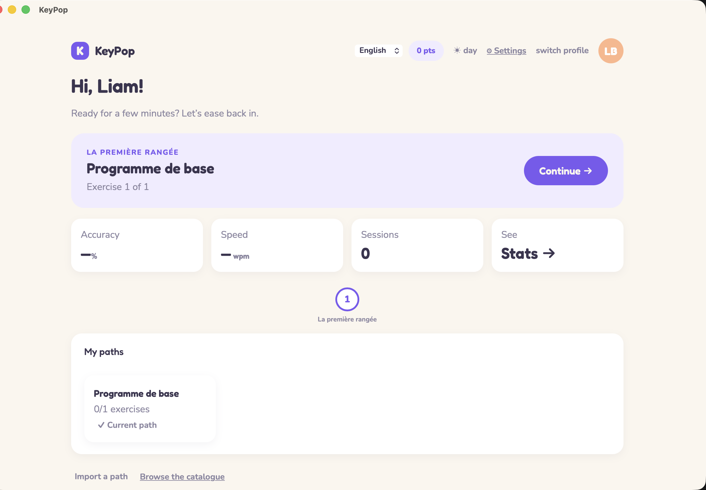
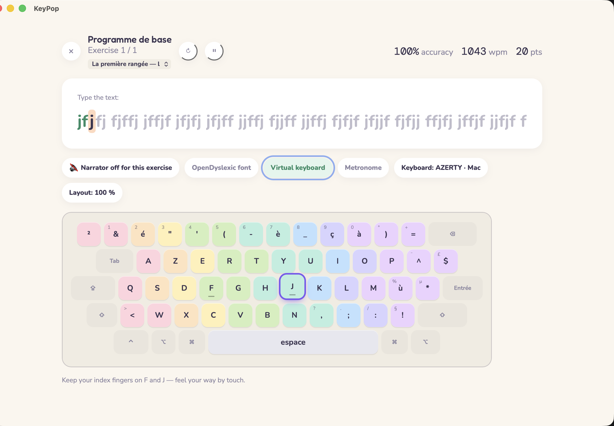
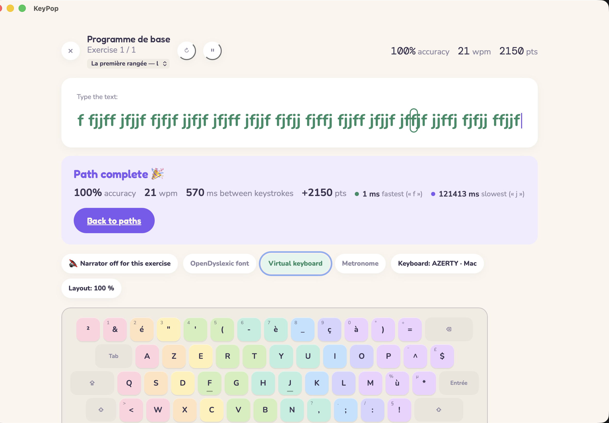
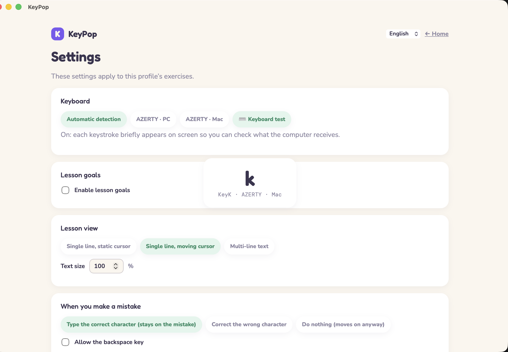
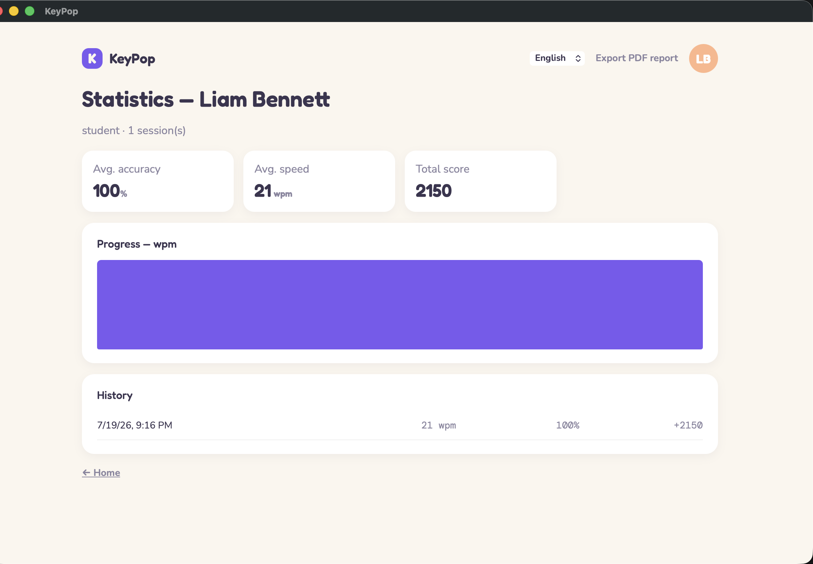
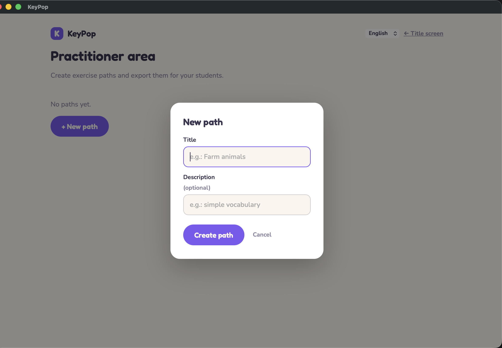

# User Guide — KeyPop

*[Lire ce guide en français](GUIDE.fr.md)*

This guide is for **students**, their **parents**, and the **occupational therapists** who use
KeyPop day to day. For technical documentation (installation, code architecture), see
[`docs/ARCHITECTURE.md`](../docs/ARCHITECTURE.md).

## Contents

- [Getting started](#getting-started)
- [Doing an exercise](#doing-an-exercise)
- [Settings during an exercise](#settings-during-an-exercise)
- [Settings screen](#settings-screen)
- [Simulating a PC or Mac keyboard](#simulating-a-pc-or-mac-keyboard)
- [My statistics](#my-statistics)
- [My paths](#my-paths)
- [Practitioner area](#practitioner-area)
- [Privacy](#privacy)

## Getting started

When the app launches, the title screen asks you to pick a **profile**. Each profile is a
student: their progress, statistics, and settings are their own and stay saved on this computer.

- **Pick an existing profile**: click its card.
- **Create a profile**: click "New profile", enter a first and last name.
- **Delete a profile**: hover its card, then click the ✕ that appears top-right (a confirmation
  is required — progress and statistics are permanently lost).

## Doing an exercise

From the home screen, the **"Continue →"** button launches the current exercise.

The principle is always the same:

1. The text to type is displayed, letter by letter.
2. The letter to type is highlighted, along with the matching key on the on-screen keyboard
   (color-coded by finger).
3. On a mistake, KeyPop stays on the same letter until it's typed correctly — accuracy comes
   before speed.
4. Once the exercise is done, a result screen shows accuracy, speed, score, and two pace
   indicators: the fastest and slowest keystroke. Both matching letters are highlighted in the
   text.

## Settings during an exercise

A row of chips (pill-shaped buttons) lets you adjust the display:

- **Audio dictation**: the next letter/word is read aloud (requires the general narrator to be
  on). *In a path created by an occupational therapist, this setting can be fixed per exercise —
  see [Practitioner area](#practitioner-area) — and is then no longer editable here.*
- **OpenDyslexic font**: switches to a font designed for dyslexic students.
- **Virtual keyboard**: shows or hides the on-screen keyboard (off by default). *In a path
  created by an occupational therapist, this can be locked off for a given exercise — see
  [Practitioner area](#practitioner-area) — and is then no longer editable here.*
- **Metronome** (off by default): when enabled, a target pace (words/min, adjustable right next
  to it) is added on top of accuracy. In the typed text, a correct letter shows in **green** if
  typed within the target time, in **yellow** if correct but too slow, and in red if it was ever
  mistyped.
- Detected keyboard and layout size are shown for reference (not editable here).
- **Restart** (↻) and **Pause** (⏸): two buttons next to the exercise title, can be turned off
  from the Settings screen.
- **Switch lesson**: a menu under the title listing every exercise in the current path (with its
  group if any, e.g. "Home row — Lesson 2"), can be turned off from the Settings screen.

## Settings screen

Reached via the **⚙ Settings** button on the home screen, this screen groups the profile's
advanced settings (they apply to every exercise, standard or custom):

- **Keyboard**: forces the displayed layout (AZERTY PC / AZERTY Mac) instead of automatic
  detection — see [Simulating a PC or Mac keyboard](#simulating-a-pc-or-mac-keyboard) below.
- **Lesson goals**: minimum speed, maximum error and slowdown rates — if enabled, each exercise's
  result shows whether the goal was met, with a recommendation (continue / redo the exercise).
- **Lesson view**: a single line with a static cursor (the text scrolls, the cursor stays put), a
  single line with a moving cursor (default), or multi-line text — plus text size.
- **When you make a mistake**: stay blocked on an error until it's corrected (default), allow
  correcting with the keyboard (backspace key), or move on anyway. Backspace is off by default
  regardless of the mode.
- **Lesson duration**: an optional time limit, with or without saving statistics if the lesson
  isn't finished in time.
- **Metronome**: besides the quick in-exercise toggle, an adaptive mode adjusts the target pace
  to the student's own rhythm over the course of the lesson, instead of a fixed value.
- **End of lesson**: show or hide the result screen and recommendation, and choose what happens
  next (continue, go to stats, or return to the title screen).
- **On app close**: automatically resume the current exercise on next launch (on by default).
- **Show during exercise**: independent toggles for the status bar (live accuracy/speed/score),
  tips, text highlighting, the toolbar, the lesson picker, and the pause/restart buttons.

## Simulating a PC or Mac keyboard

A Mac keyboard and a PC keyboard don't always place the same symbols (`@`, `#`, `{`, `}`…) on the
same key. The **AZERTY · PC** / **AZERTY · Mac** selector in Settings > Keyboard doesn't just
change the on-screen labels: it tells KeyPop which key to expect for which character during
exercises — useful for practicing on a PC-style keyboard while on a Mac, or the reverse, without
touching the computer's actual system settings.

To check what the computer is really receiving, the **⌨️ Keyboard test** button briefly displays
each key pressed on screen (the character, the key's physical code, and the active layout):

## My statistics

The **Stats** screen (reached from the home screen) summarizes progress: average accuracy and
speed, total score, a progress chart, and a history of recent sessions.

The **"Export PDF report"** button lets the occupational therapist or parent keep a printable
record of the student's progress.

## My paths

A **path** is a sequence of exercises. KeyPop's own standard program (from resting position to
full sentences) is a path like any other — it's already there when a profile is created — and an
occupational therapist can prepare others tailored to a student (see next section), for example
around a theme (the farm, everyday sentences…). All of a profile's paths appear together in the
**"My paths"** section of the home screen, along with their progress (e.g. "2/5 exercises"); the
**"Use this path →"** button makes a path active — that's the one the home screen's
**"Continue →"** button launches.

**Importing a path**, from the home screen:

- **From a file**: "Import a path" button, then pick the `.kp` file received from the
  occupational therapist (by email, USB drive, etc.).
- **From the catalogue**: "Browse the catalogue" button — a selection of ready-to-use paths,
  available even offline. The **"🔄 Check for updates"** button fetches the latest versions
  online; if a path that's already imported has been updated, KeyPop asks whether to keep the
  current progress or start over.

## Practitioner area

Reached via the **"Practitioner area"** button at the top of the title screen (no password — the
app stays 100% local). This is where custom paths are prepared for a student or group of
students.

**Creating a path:**

1. "+ New path" → enter a title (and an optional description).
2. Add exercises one at a time: type the exercise text in the field provided, with two optional
   fields — **Group** (e.g. "Home row", to group several exercises under one heading shown to
   the student) and **Hint** (e.g. "a s d f g", shown under the group). Also choose the
   **narrator** (a 3-state chip: free — follows the student's own setting —, locked on, or
   locked off) and whether the **virtual keyboard** should be locked off for this exercise (⌨️
   Keyboard free / locked chip — locked means the student can no longer turn it on), then confirm
   with "+ Add exercise".
3. Exercises already added can be reordered (↑ / ↓), edited directly in their text field, or
   removed (✕). Everything saves automatically — there's no "Save" button.

**Sharing a path:** the "Export" button downloads the path as a `.kp` file — to send to the
student however you like (email, USB drive…) for direct import, or to submit for inclusion in
the project's shared catalogue.

## Interface language

A language selector (dropdown) is available at the top of every screen. The choice is remembered
on this computer. Only the interface is translated — lesson content stays in French, since the
method is built around the AZERTY keyboard.

## Privacy

KeyPop collects no data, requires no account, and only talks to the internet if you explicitly
click the catalogue's "Check for updates" (no automatic connection). All profiles, paths, and
statistics stay saved only on the computer being used.
