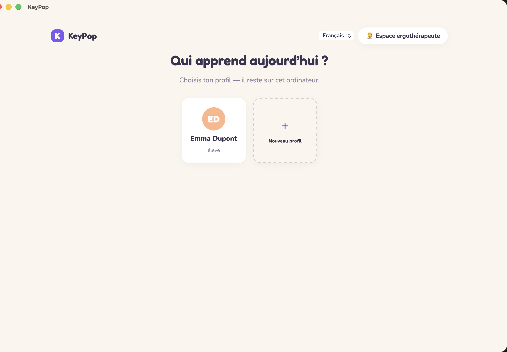
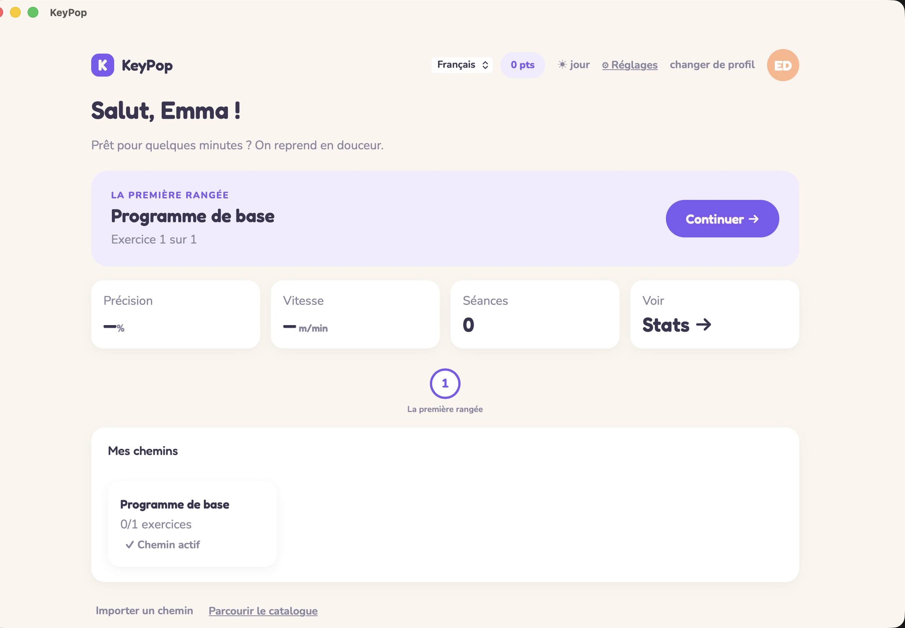
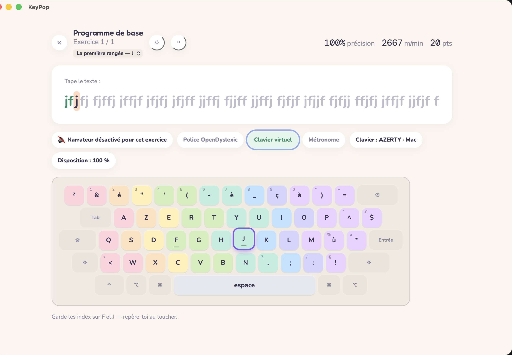
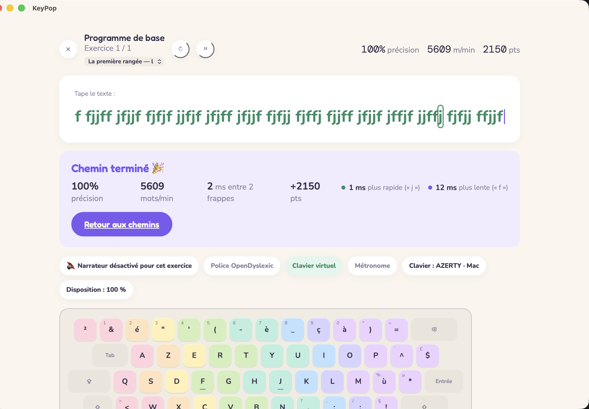
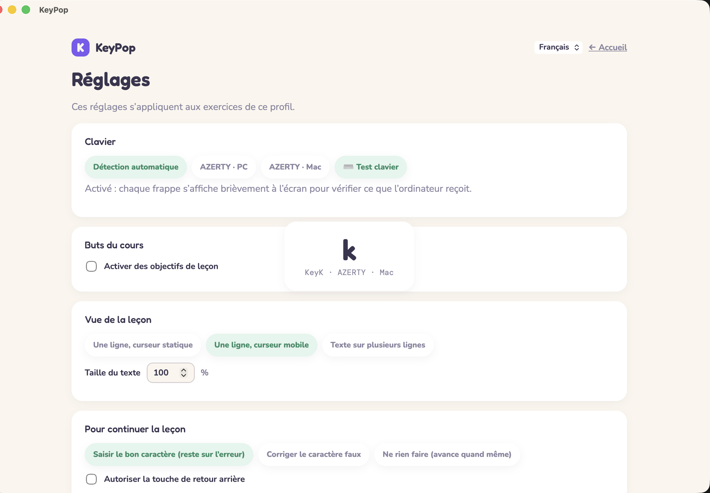
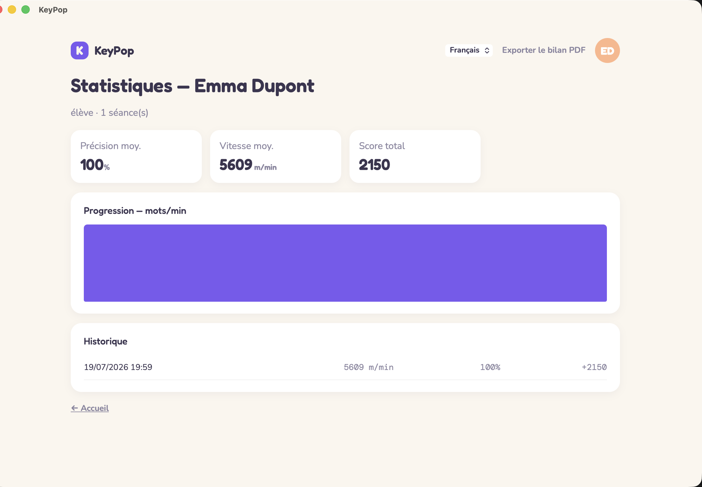
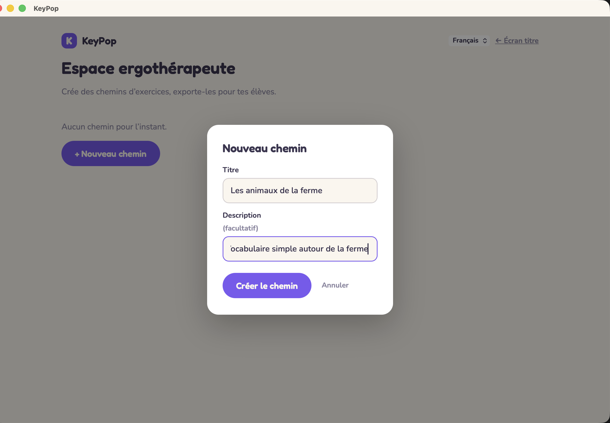

# Guide d'utilisation — KeyPop

*[Read this guide in English](GUIDE.en.md)*

Ce guide s'adresse aux **élèves**, à leurs **parents** et aux **ergothérapeutes** qui utilisent
KeyPop au quotidien. Pour la documentation technique (installation, architecture du code), voir
[`docs/ARCHITECTURE.md`](../docs/ARCHITECTURE.md).

## Sommaire

- [Premiers pas](#premiers-pas)
- [Faire un exercice](#faire-un-exercice)
- [Réglages pendant un exercice](#réglages-pendant-un-exercice)
- [Écran Réglages](#écran-réglages)
- [Simuler un clavier PC ou Mac](#simuler-un-clavier-pc-ou-mac)
- [Mes statistiques](#mes-statistiques)
- [Mes chemins](#mes-chemins)
- [Espace ergothérapeute](#espace-ergothérapeute)
- [Vie privée](#vie-privée)

## Premiers pas

Au lancement de l'application, l'écran titre propose de choisir un **profil**. Chaque profil
correspond à un élève : sa progression, ses statistiques et ses réglages lui sont propres et
restent enregistrés sur cet ordinateur.

- **Choisir un profil existant** : cliquer sur sa carte.
- **Créer un profil** : cliquer sur « Nouveau profil », indiquer un prénom et un nom.
- **Supprimer un profil** : survoler sa carte, puis cliquer sur le ✕ qui apparaît en haut à
  droite (une confirmation est demandée — la progression et les statistiques sont perdues
  définitivement).

## Faire un exercice

Depuis l'accueil, le bouton **« Continuer → »** lance l'exercice du moment.

Le principe est toujours le même :

1. Le texte à taper s'affiche, lettre par lettre.
2. La lettre à taper est surlignée, ainsi que la touche correspondante sur le clavier affiché
   à l'écran (avec un code couleur par doigt).
3. En cas d'erreur, KeyPop reste sur la même lettre jusqu'à ce qu'elle soit tapée correctement —
   la précision prime sur la vitesse.
4. Une fois l'exercice terminé, un écran de résultat affiche précision, vitesse, score, et deux
   indicateurs de rythme : la frappe la plus rapide et la plus lente. Les deux lettres
   correspondantes sont surlignées dans le texte.

## Réglages pendant un exercice

Une rangée de « chips » (boutons arrondis) permet d'ajuster l'affichage :

- **Dictée audio** : la prochaine lettre/mot est lu à voix haute (nécessite le narrateur général
  activé). *Dans un chemin créé par un·e ergothérapeute, ce réglage est fixé par exercice — voir
  [Espace ergothérapeute](#espace-ergothérapeute) — et n'est plus modifiable ici.*
- **Police OpenDyslexic** : bascule vers une police pensée pour les élèves dyslexiques.
- **Clavier virtuel** : affiche ou masque le clavier à l'écran (désactivé par défaut). *Dans un
  chemin créé par un·e ergothérapeute, ce réglage peut être verrouillé sur off pour un exercice —
  voir [Espace ergothérapeute](#espace-ergothérapeute) — et n'est alors plus modifiable ici.*
- **Métronome** (désactivé par défaut) : quand il est activé, une cadence cible (en mots/min,
  réglable juste à côté) s'ajoute à la précision. Dans le texte tapé, une lettre juste s'affiche
  en **vert** si elle est tapée dans le temps imparti, en **jaune** si elle est juste mais trop
  lente, et en rouge si elle a été fautive à un moment donné.
- Les informations sur le clavier détecté et la taille de disposition sont affichées à titre
  indicatif (non modifiables ici).
- **Redémarrer** (↻) et **Pause** (⏸) : deux boutons à côté du titre de l'exercice, désactivables
  depuis l'écran Réglages.
- **Changer de leçon** : un menu sous le titre listant tous les exercices du chemin en cours
  (avec leur groupe s'il y en a un, ex. « La rangée de repos — Leçon 2 »), désactivable depuis
  l'écran Réglages.

## Écran Réglages

Accessible via le bouton **⚙ Réglages** de l'accueil, cet écran regroupe les réglages avancés du
profil (ils s'appliquent à tous les exercices, standards comme personnalisés) :

- **Clavier** : force la disposition affichée (AZERTY PC / AZERTY Mac) au lieu de la détection
  automatique — voir [Simuler un clavier PC ou Mac](#simuler-un-clavier-pc-ou-mac) ci-dessous.
- **Buts du cours** : vitesse minimale, taux d'erreurs et de ralentissements maximum — si activés,
  le résultat de chaque exercice indique si l'objectif est atteint, avec une recommandation
  (continuer / refaire l'exercice).
- **Vue de la leçon** : une ligne à curseur statique (le texte défile, le curseur reste fixe), une
  ligne à curseur mobile (par défaut), ou texte sur plusieurs lignes — et la taille du texte.
- **Pour continuer la leçon** : rester bloqué sur une erreur jusqu'à la correction (par défaut),
  autoriser la correction au clavier (touche retour arrière), ou avancer même en cas d'erreur.
  La touche retour arrière est désactivée par défaut quel que soit le mode.
- **Durée de la leçon** : limite de temps optionnelle, avec sauvegarde ou non des statistiques si
  la leçon n'est pas terminée à temps.
- **Métronome** : en plus du réglage rapide pendant l'exercice, un mode adaptatif ajuste la
  cadence cible au rythme propre de l'élève au fil de la leçon, plutôt qu'à une valeur fixe.
- **Fin de la leçon** : afficher ou non l'écran de résultat et la recommandation, et choisir ce qui
  se passe ensuite (continuer, aller aux statistiques, ou revenir à l'écran titre).
- **À la fermeture de l'application** : reprendre automatiquement l'exercice en cours au prochain
  lancement (activé par défaut).
- **Afficher pendant l'exercice** : bascules indépendantes pour la barre d'état (précision/
  vitesse/score en direct), les conseils, la surbrillance du texte, la barre d'outils, les
  sélecteurs de leçon, et les boutons pause/redémarrer.

## Simuler un clavier PC ou Mac

Un clavier Mac et un clavier PC ne placent pas toujours les mêmes symboles (`@`, `#`, `{`, `}`…) au
même endroit. Le sélecteur **AZERTY · PC** / **AZERTY · Mac** dans Réglages > Clavier ne se
contente pas de changer l'affichage : il dit à KeyPop quelle touche attendre pour quel caractère
pendant les exercices — utile pour s'exercer à un clavier PC sur un Mac, ou l'inverse, sans rien
changer aux réglages système de l'ordinateur.

Pour vérifier ce que l'ordinateur reçoit réellement, le bouton **⌨️ Test clavier** affiche
brièvement à l'écran chaque touche pressée (le caractère, le code physique de la touche, et la
disposition active) :

## Mes statistiques

L'écran **Stats** (accessible depuis l'accueil) résume la progression : précision et vitesse
moyennes, score total, graphique d'évolution et historique des dernières séances.

Le bouton **« Exporter le bilan PDF »** permet à l'ergothérapeute ou au parent de garder une trace
imprimable des progrès de l'élève.

## Mes chemins

Un **chemin** est une suite d'exercices. Le programme standard de KeyPop (de la position de repos
aux phrases) en est un lui-même — il est présent dès la création du profil — et un·e
ergothérapeute peut en préparer d'autres sur mesure (voir section suivante), par exemple autour
d'un thème (la ferme, les phrases du quotidien…). Tous les chemins d'un profil apparaissent
ensemble dans la section **« Mes chemins »** de l'accueil, avec leur progression (ex.
« 2/5 exercices ») ; le bouton **« Choisir ce chemin → »** rend un chemin actif — c'est lui que
lance le bouton **« Continuer → »** de l'accueil.

**Importer un chemin**, depuis l'accueil :

- **Depuis un fichier** : bouton « Importer un chemin », puis choisir le fichier `.kp` reçu
  de l'ergothérapeute (par e-mail, clé USB, etc.).
- **Depuis le catalogue** : bouton « Parcourir le catalogue » — une sélection de chemins prêts à
  l'emploi, disponible même hors connexion. Le bouton **« 🔄 Rechercher des mises à jour »** va
  chercher les dernières versions en ligne ; si un chemin déjà importé a été mis à jour, KeyPop
  demande s'il faut garder la progression en cours ou repartir de zéro.

## Espace ergothérapeute

Accessible via le bouton **« Espace ergothérapeute »** en haut de l'écran titre (aucun mot de
passe — l'application reste 100 % locale). C'est ici que l'on prépare des chemins sur mesure pour
un élève ou un groupe d'élèves.

**Créer un chemin :**

1. « + Nouveau chemin » → indiquer un titre (et une description facultative).
2. Ajouter les exercices un par un : taper le texte de l'exercice dans l'encart prévu, avec
   deux champs optionnels — **Groupe** (ex. « La rangée de repos », pour regrouper plusieurs
   exercices sous un même titre affiché à l'élève) et **Indice** (ex. « q s d f g », affiché sous
   le groupe). Choisir aussi le **narrateur** (chip à 3 états : libre — suit le réglage de
   l'élève —, verrouillé activé, ou verrouillé désactivé) et si le **clavier virtuel** doit être
   verrouillé sur off pour cet exercice (chip ⌨️ Clavier libre / verrouillé — verrouillé signifie
   que l'élève ne peut plus l'activer), puis valider avec « + Ajouter l'exercice ».
3. Les exercices déjà ajoutés peuvent être réordonnés (↑ / ↓), modifiés directement dans leur
   encart de texte, ou supprimés (✕). Tout est enregistré automatiquement, pas besoin de bouton
   « Enregistrer ».

**Partager un chemin :** le bouton « Exporter » télécharge le chemin sous forme de fichier `.kp`
— à transmettre à l'élève par le moyen de son choix (e-mail, clé USB…) pour import direct, ou à
proposer pour inclusion dans le catalogue partagé du projet.

## Langue de l'interface

Un sélecteur de langue (menu déroulant) est disponible en haut de chaque écran. Le choix est
mémorisé sur cet ordinateur. Seule l'interface est traduite — le contenu des leçons reste en
français, la méthode étant construite autour du clavier AZERTY.

## Vie privée

KeyPop ne collecte aucune donnée, ne nécessite aucun compte et ne communique avec Internet que si
l'utilisateur clique explicitement sur « Rechercher des mises à jour » du catalogue (aucune
connexion automatique). Tous les profils, chemins et statistiques restent enregistrés uniquement
sur l'ordinateur utilisé.
